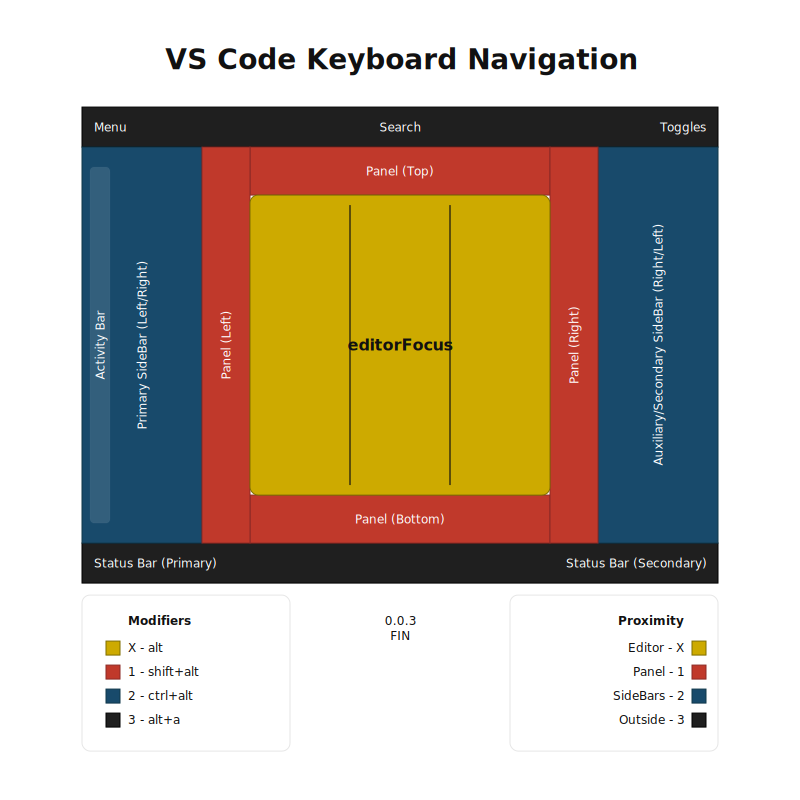

# VS Code Keyboard Navigation

This directory contains reference datasets and docs used by tests and tooling.

## keybindings data groups

- `keybindings.corpus*.jsonc`
  - minimal skeleton/corpus data sets.
  - useful for lightweight structure and baseline parsing tests.

- `keybindings.map*.jsonc`
  - larger VS Code mapping data sets.
  - focused on `when`-conditioned UI coordinates for common elements.

- `keybindings.surface*.jsonc`
  - combined corpus + map data sets.
  - represent a valid navigation "surface" (a dimensional plane) for focal-invariant movement logic.

## practical test usage

- prefer `keybindings.surface.vi.jsonc` for quick/smoke/perf-short runs.
- prefer `keybindings.surface.all.jsonc` for exhaustive/perf-full baselines.
